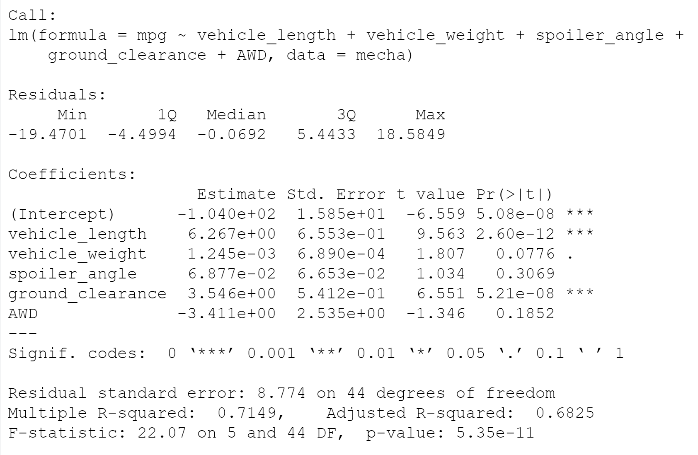
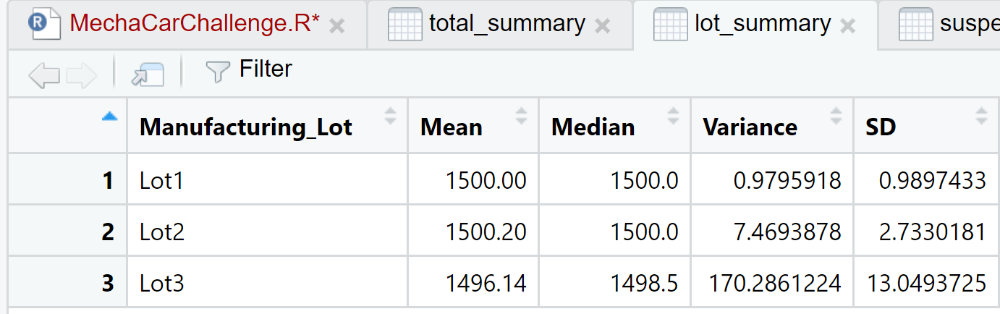
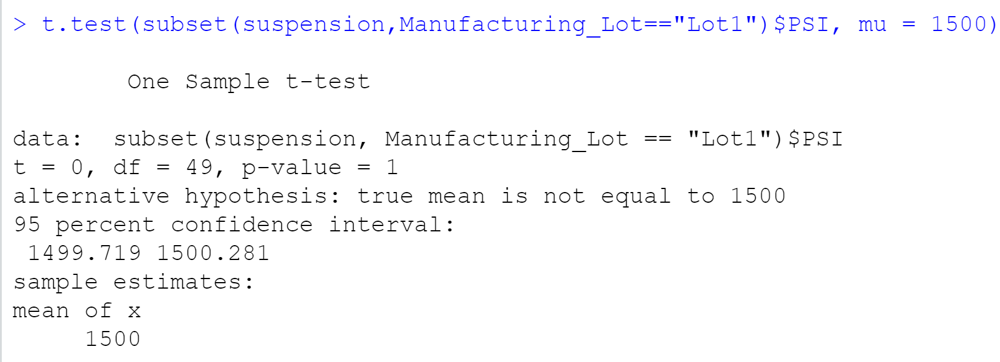
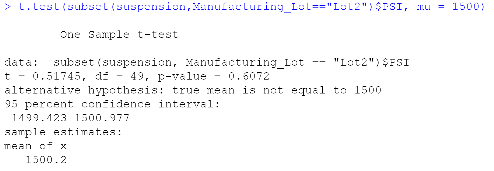
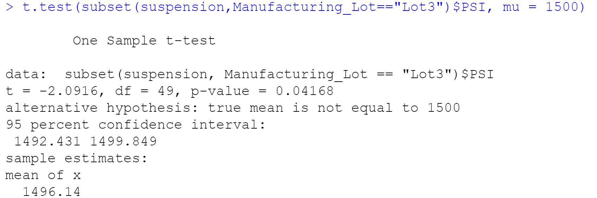

# MechaCar_Statistical_Analysis

## Purpose
The purpose of this project was to run statistical analysis on data collected from car prototype manufacturing

## Linear Regression to Predict MPG

### Which variables/coefficients provided a non-random amount of variance to the mpg values in the dataset?
The vehicle length and ground clearance variables 

### Is the slope of the linear model considered to be zero? Why or why not?
The p-value is lower than the significance level, which means the slope is not considered to be zero.  

### Does this linear model predict mpg of MechaCar prototypes effectively? Why or why not?
The R-squared value signifies that this model is 71% accurate, which is pretty effective.

## Summary Statistics on Suspension Coils

### The design specifications for the MechaCar suspension coils dictate that the variance of the suspension coils must not exceed 100 pounds per square inch. Does the current manufacturing data meet this design specification for all manufacturing lots in total and each lot individually? Why or why not?
Not all individual lots meet the design specifications, but taking them as a total they do.  Across all total lots the variance was 62.29356. Individually, Lot 1 and Lot 2 were less than 100, but the variance for Lot 3 was 170.2861224 

## T-Tests on Suspension Coils

Lot 1 and Lot 2 had p-values both higher than the significance level, meaning we could not reject the null hypothesis. Lot 3, however, has a p-value of 0.04 which is lower than the significance level. This means we should reject the null hypothesis.

## Study Design: MechaCar vs Competition
I think it would be important to understand how MechaCar's fuel efficiency compares to the competition and how other factors that contribute to performance of a car could impact the fuel efficiency

### What metric or metrics are you going to test?
MPG, engine type, engine size, horsepower, torque, 0-60 time

### What is the null hypothesis or alternative hypothesis?
Null = There is no difference in fuel efficiency between MechaCar and competitors with similar performance
Alt = There is a difference in fuel efficiency between MechaCar and competitors with similar performance

### What statistical test would you use to test the hypothesis? And why?
A multiple linear regression would be good to see the various factors that might correlate to or predict higher/lower fuel efficiency

### What data is needed to run the statistical test?
The metrics noted above for MechaCar and multiple competitors. For the competitors we will need make and model information as well.